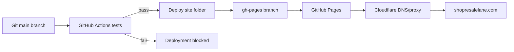
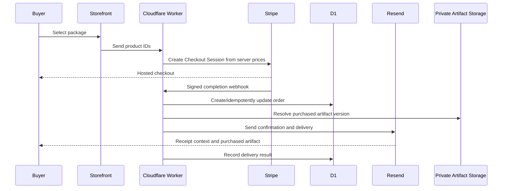

# ResaleLane Architecture

## Current Production System

ResaleLane is currently a static storefront built with HTML, CSS, and browser JavaScript. It does not use React, Vite, a database, or a server.

| Layer | Current implementation |
| --- | --- |
| Frontend | Static files in `site/` |
| Cart state | Browser `localStorage` |
| Tests | Node.js built-in test runner |
| CI | GitHub Actions |
| Preview | GitHub Pages PR preview paths |
| Stable staging | `staging` branch at `/staging/` |
| Production | GitHub Pages `gh-pages` branch |
| Domain/DNS | Cloudflare |
| Payments | Disabled placeholder until Stripe is configured |

## Request And Deployment Flow

## File Responsibilities

- `site/index.html`: semantic page content, SEO metadata, dialogs, and form structure.
- `site/styles.css`: design tokens, layouts, responsive breakpoints, and animation.
- `site/app.js`: browser interactions and rendering.
- `site/cart-logic.js`: pure cart decision logic shared by the app and tests.
- `site/assets/`: public brand assets only.
- `scripts/build.mjs`: creates the fingerprinted release in ignored `dist/`.
- `test/site.test.js`: automated regression and safety checks.
- `.github/workflows/ci.yml`: standalone/reusable test workflow.
- `.github/workflows/deploy.yml`: production deployment after tests.
- `.github/workflows/preview.yml`: pull-request preview after tests.
- `.github/workflows/staging.yml`: stable staging-path deployment after tests.
- `.github/workflows/uptime.yml`: daily production availability and content check.

## Release And Cache Model

Source files keep stable readable names under `site/`. CI creates deployment-only files whose names include the full Git commit SHA. The deployed HTML and `release.json` carry the same release ID.

This means:

- A new release cannot accidentally reuse an old CSS or JavaScript URL.
- Staging and production can be verified against an exact commit.
- URLs returned after a push always include `?release=<commit-sha>` to bypass cached HTML.
- Old release assets may remain temporarily, but they cannot be mixed into new HTML.

## Security Boundary

The public repository and GitHub Pages can only contain information safe for anyone to download.

Private supplier data, Stripe secret keys, webhook secrets, email-service keys, and order records must live in a future server-side backend. They must never be placed in `site/`, Git history, or browser JavaScript.

## Future Backend

When Stripe is available, a server-side service should:

1. Accept product IDs, never client-provided prices.
2. Map IDs to authoritative Stripe Price IDs.
3. Create Stripe Checkout sessions.
4. Verify signed Stripe webhooks.
5. Send the purchased package by email.
6. Save order and delivery status.

Cloudflare Workers plus D1 and an email provider are suitable options, but they are not active yet.

## Target Transaction Architecture

Stripe remains the payment receipt authority. ResaleLane sends a separate order confirmation and fulfillment email containing the order ID, purchased items, support details, policy summary, and the secured delivery artifact.

## Environment Strategy

Current interim separation:

- Feature/PR preview: per-PR Pages path
- Stable staging: `/staging/`
- Production: domain root

Target separation:

- Dedicated staging project and hostname, ideally `staging.shopresalelane.com`
- Separate test/live Stripe keys and webhook endpoints
- Separate D1 databases and Resend test/production configuration
- Production deployment only after staging approval
