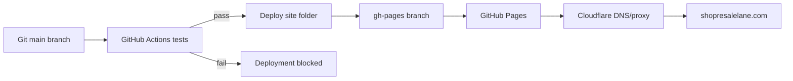
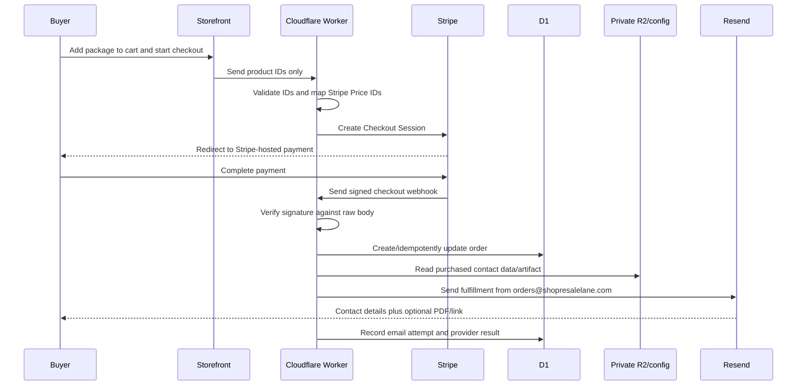

# ResaleLane Architecture

## Current Production System

ResaleLane is currently a static storefront built with HTML, CSS, and browser JavaScript. It does not use React, Vite, a database, or a server.

| Layer | Current implementation |
| --- | --- |
| Frontend | Static files in `site/` |
| Cart state | Browser `localStorage` |
| Tests | Node.js built-in test runner |
| CI | GitHub Actions |
| Preview | GitHub Pages PR preview paths |
| Stable staging | `staging` branch at `/staging/` |
| Production | GitHub Pages `gh-pages` branch |
| Domain/DNS | Cloudflare |
| Payments | Disabled placeholder until Stripe is configured |

## Request And Deployment Flow

## File Responsibilities

- `site/index.html`: semantic page content, SEO metadata, dialogs, and form structure.
- `site/styles.css`: design tokens, layouts, responsive breakpoints, and animation.
- `site/app.js`: browser interactions and rendering.
- `site/cart-logic.js`: pure cart decision logic shared by the app and tests.
- `site/assets/`: public brand assets only.
- `Design System/design_handoff_resalelane/`: original public-safe design handoff, tokens, catalog model, prototypes, and brand exports.
- `scripts/build.mjs`: creates the fingerprinted release in ignored `dist/`.
- `docs/ARTIFACT-SECURITY.md`: private-artifact storage and secure-delivery design.
- `migrations/`: versioned D1 schema for orders, payment events, delivery attempts, and support request metadata.
- `docs/DATA-RETENTION.md`: buyer-data minimization, anonymization, and recovery rules.
- `docs/PRD.md` and `docs/WEBSITE-SPEC.md`: tracked requirements that replace unreadable local Google Drive shortcuts.
- `server/email-templates.js`: provider-independent transactional email templates for the future Worker.
- `test/site.test.js`: automated regression and safety checks.
- `.github/workflows/ci.yml`: standalone/reusable test workflow.
- `.github/workflows/deploy.yml`: production deployment after tests.
- `.github/workflows/preview.yml`: pull-request preview after tests.
- `.github/workflows/staging.yml`: stable staging-path deployment after tests.
- `.github/workflows/uptime.yml`: daily production availability and content check.

## Release And Cache Model

Source files keep stable readable names under `site/`. CI creates deployment-only files whose names include the full Git commit SHA. The deployed HTML and `release.json` carry the same release ID.

This means:

- A new release cannot accidentally reuse an old CSS or JavaScript URL.
- Staging and production can be verified against an exact commit.
- URLs returned after a push always include `?release=<commit-sha>` to bypass cached HTML.
- Old release assets may remain temporarily, but they cannot be mixed into new HTML.

## Security Boundary

The public repository and GitHub Pages can only contain information safe for anyone to download.

Private supplier data, Stripe secret keys, webhook secrets, email-service keys, and order records must live in a future server-side backend. They must never be placed in `site/`, Git history, or browser JavaScript.

The repository is the collaboration source of truth. Google Drive may hold drafts and private operational files, but code, public-safe assets, and approved decisions are not considered current until they are represented in Git.

## Approved Backend Target

The Cloudflare Worker is active for support email. Separate staging and production D1 databases and private R2 buckets are connected through environment-specific bindings. Checkout remains disabled until Stripe and the remaining order/fulfillment flows are configured and tested.

The Worker exposes a public-safe `/health` response containing API version, environment name, and connection status only. It never returns database identifiers, bucket names, secrets, customer records, or provider errors.

| Responsibility | Approved service |
| --- | --- |
| Public storefront | GitHub Pages |
| Checkout API, support form, and webhook | Cloudflare Worker |
| Hosted payment page and receipt | Stripe Checkout |
| Order and delivery-attempt records | Cloudflare D1 |
| Private package contact data and optional files | Cloudflare R2 or Worker-only configuration |
| Fulfillment email | Resend from `orders@shopresalelane.com` |
| Support notifications | Resend from `support@shopresalelane.com` to the support Gmail inbox |

The Worker accepts product IDs only, maps them to server-controlled Stripe Price IDs, and owns every privileged action. Cloudflare bindings grant the Worker access to D1 and R2 without exposing storage credentials or object identifiers to the browser.

The public contact form posts to `https://api.shopresalelane.com/support`. The Worker validates and limits requests, uses a hidden bot-trap field, and sends the message through Resend. The `RESEND_API_KEY` is stored only as a Cloudflare Worker secret. Visitor email addresses are used as the reply-to address and are not written to public files or routine logs.

D1 stores buyer/order metadata needed for payment verification, idempotency, delivery tracking, and support. Supplier contacts, PDF contents, and private package data remain in private R2 and are never copied into D1.

## Target Transaction Architecture

Stripe remains the payment receipt authority. ResaleLane sends a separate order confirmation and fulfillment email containing the order ID, purchased items, support details, policy summary, contact details, and any optional PDF or secure link.

## Transaction Safety Rules

- Never accept a browser-supplied price, Stripe Price ID, R2 key, or fulfillment content.
- Verify the Stripe signature before parsing or acting on a webhook.
- Use Stripe event and Checkout Session IDs to make order creation and fulfillment idempotent.
- Keep R2 private and expose package data only after a verified purchase.
- Store order state, artifact version, email attempt, provider message ID, and failure category in D1.
- Do not store private contact data, raw delivery tokens, or secrets in routine logs.
- Authenticate `shopresalelane.com` with Resend before enabling `orders@shopresalelane.com`.
- Retry failed email delivery without creating a second order or duplicate successful fulfillment.

## Environment Strategy

Approved frontend separation:

- Feature/PR preview: per-PR Pages path
- Stable staging: `/staging/`
- Production: domain root

Backend environment separation:

- The existing `/staging/` path is sufficient; a dedicated staging hostname is not required.
- Staging uses Stripe test-mode keys and a test webhook secret.
- Staging and production use separate D1 databases and R2 buckets/bindings.
- Staging contains synthetic package data and cannot access production contacts.
- Resend testing must not send fulfillment to real customers.
- Production deployment occurs only after staging verification.
