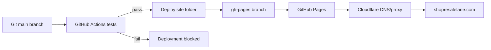

# ResaleLane Architecture

## Current Production System

ResaleLane is currently a static storefront built with HTML, CSS, and browser JavaScript. It does not use React, Vite, a database, or a server.

| Layer | Current implementation |
| --- | --- |
| Frontend | Static files in `site/` |
| Cart state | Browser `localStorage` |
| Tests | Node.js built-in test runner |
| CI | GitHub Actions |
| Preview | GitHub Pages PR preview workflow |
| Production | GitHub Pages `gh-pages` branch |
| Domain/DNS | Cloudflare |
| Payments | Disabled placeholder until Stripe is configured |

## Request And Deployment Flow

## File Responsibilities

- `site/index.html`: semantic page content, SEO metadata, dialogs, and form structure.
- `site/styles.css`: design tokens, layouts, responsive breakpoints, and animation.
- `site/app.js`: browser interactions and rendering.
- `site/cart-logic.js`: pure cart decision logic shared by the app and tests.
- `site/assets/`: public brand assets only.
- `test/site.test.js`: automated regression and safety checks.
- `.github/workflows/ci.yml`: standalone/reusable test workflow.
- `.github/workflows/deploy.yml`: production deployment after tests.
- `.github/workflows/preview.yml`: pull-request preview after tests.

## Security Boundary

The public repository and GitHub Pages can only contain information safe for anyone to download.

Private supplier data, Stripe secret keys, webhook secrets, email-service keys, and order records must live in a future server-side backend. They must never be placed in `site/`, Git history, or browser JavaScript.

## Future Backend

When Stripe is available, a server-side service should:

1. Accept product IDs, never client-provided prices.
2. Map IDs to authoritative Stripe Price IDs.
3. Create Stripe Checkout sessions.
4. Verify signed Stripe webhooks.
5. Send the purchased package by email.
6. Save order and delivery status.

Cloudflare Workers plus D1 and an email provider are suitable options, but they are not active yet.
